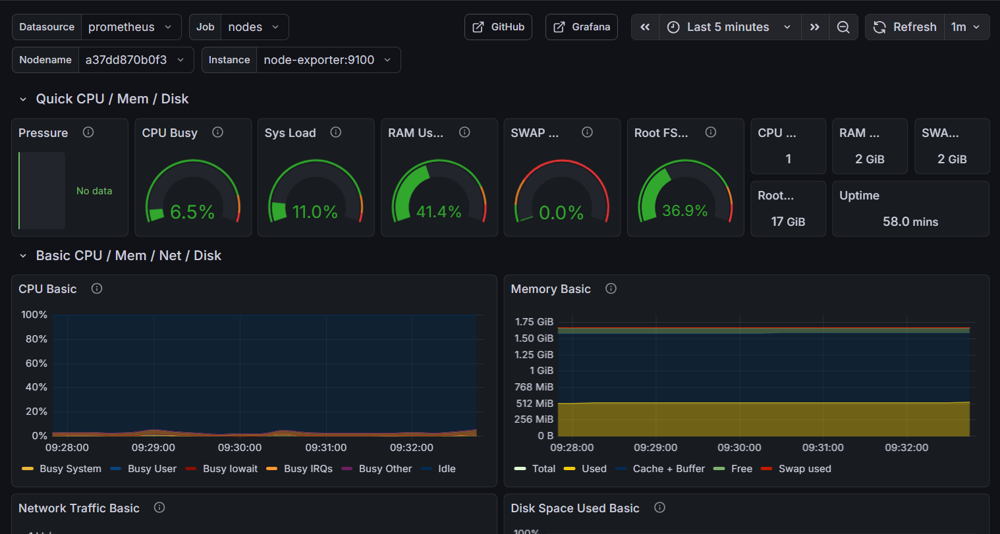
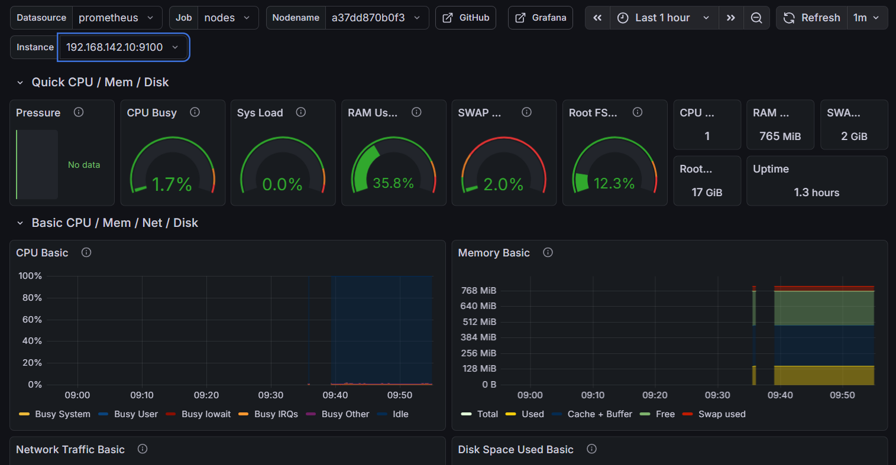
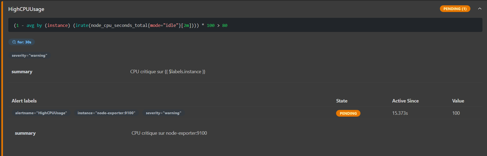
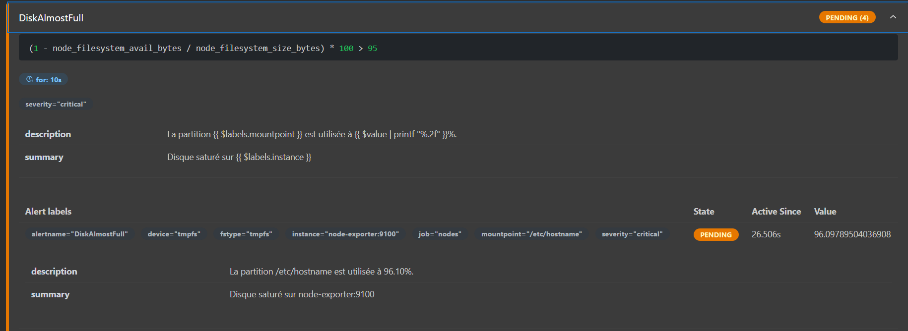

# Projet : Architecture Réseau Distribuée et Sécurisée avec Sauvegarde Déportée

## 🌐 1. Architecture et Topologie

Ce projet déploie une infrastructure réseau cloisonnée simulant un environnement d'entreprise robuste. L'architecture respecte les bonnes pratiques de sécurité : séparation des rôles (DNS vs Apps), isolation des sauvegardes, et chiffrement des flux.

### 1.1. Inventaire des Machines (VMs)

Le réseau Host-Only est : **192.168.142.0/24**.

| Machine | Nom d'Hôte | Rôle Principal | IP Statique |
| :--- | :--- | :--- | :--- |
| **VM 1** | **`SRV-DNS`** | Serveur de Noms & Passerelle DNS | **192.168.142.10** |
| **VM 2** | **`SRV-APPS`** | Web (HTTPS) & Fichiers (Samba) | **192.168.142.11** |
| **VM 3** | **`SRV-BACKUP`** | Stockage de Sauvegarde Isolé | **192.168.142.12** |
| **VM 4** | **`CLI-TEST`** | Client Utilisateur | **192.168.142.20** |

### 1.2. Prérequis VirtualBox

  * **Adaptateur 1 :** NAT (Accès Internet).
  * **Adaptateur 2 :** Réseau Hôte-Seul (Host-Only Adapter).

-----

## 🛠️ 2. Configuration IP Initiale (Sur toutes les VMs)

Pour éviter les conflits d'IP et l'écrasement par le DHCP, nous forçons la configuration statique via `nmcli`.

**Sur VM 1 (SRV-DNS) :**

```bash
sudo hostnamectl set-hostname SRV-DNS
sudo nmcli con add type ethernet ifname enp0s8 con-name static-hostonly ip4 192.168.142.10/24 autoconnect yes
sudo nmcli con up static-hostonly
```

**Sur VM 2 (SRV-APPS) :**

```bash
sudo hostnamectl set-hostname SRV-APPS
sudo nmcli con add type ethernet ifname enp0s8 con-name static-hostonly ip4 192.168.142.11/24 autoconnect yes
sudo nmcli con up static-hostonly
```

**Sur VM 3 (SRV-BACKUP) :**

```bash
sudo hostnamectl set-hostname SRV-BACKUP
sudo nmcli con add type ethernet ifname enp0s8 con-name static-hostonly ip4 192.168.142.12/24 autoconnect yes
sudo nmcli con up static-hostonly
```

**Sur VM 4 (CLI-TEST) :**

```bash
sudo hostnamectl set-hostname CLI-TEST
sudo nmcli con add type ethernet ifname enp0s8 con-name static-hostonly ip4 192.168.142.20/24 autoconnect yes
sudo nmcli con up static-hostonly
```

-----

## 🧠 3. VM 1 : SRV-DNS (Le Cerveau du Réseau)

Il résout les noms locaux (`.lan`) et transmet les requêtes inconnues vers Internet (*Forwarding*), permettant aux autres serveurs (comme Backup) de faire leurs mises à jour.

### 3.1. Installation et Pare-feu

```bash
sudo dnf install bind bind-utils -y
sudo systemctl enable --now firewalld
sudo firewall-cmd --permanent --add-port={53/tcp,53/udp}
sudo firewall-cmd --reload
```

### 3.2. Configuration BIND (`/etc/named.conf`)

Modifiez les options pour écouter sur le réseau et activer le forwarding.

```bash
sudo vi /etc/named.conf
```

**Modifications clés :**

```conf
options {
    listen-on port 53 { 127.0.0.1; 192.168.142.10; }; # Ajouter l'IP locale
    allow-query     { localhost; 192.168.142.0/24; }; # Autoriser le réseau
    
    # Activer le forwarding vers Google (pour que les VMs aient internet via le DNS)
    forward only;
    forwarders { 8.8.8.8; };
};

# Ajouter la zone à la fin :
zone "monlabo.lan" IN {
    type master;
    file "db.monlabo.lan";
    allow-update { none; };
};
```

### 3.3. Fichier de Zone (`/var/named/db.monlabo.lan`)

```bash
sudo cp /var/named/named.localhost /var/named/db.monlabo.lan
sudo vi /var/named/db.monlabo.lan
```

**Contenu :**

```text
$TTL 86400
@   IN  SOA     srv-dns.monlabo.lan. root.monlabo.lan. (
    2025121102  ; Serial
    3600        ; Refresh
    1800        ; Retry
    604800      ; Expire
    86400 )     ; Minimum TTL

    IN  NS      srv-dns.monlabo.lan.
    IN  A       192.168.142.10

srv-dns     IN  A   192.168.142.10
srv-apps    IN  A   192.168.142.11
srv-backup  IN  A   192.168.142.12

; Services
web         IN  A   192.168.142.11
fichiers    IN  A   192.168.142.11
```

**Finalisation :**

```bash
sudo systemctl enable --now named
sudo systemctl restart named
```

-----

## ⚙️ 4. VM 2 : SRV-APPS (Services Web & Fichiers)

### 4.1. Installation et Sécurité

```bash
sudo dnf install nginx samba samba-client rsync cronie -y
sudo systemctl enable --now firewalld
sudo firewall-cmd --permanent --add-service={http,https}
sudo firewall-cmd --permanent --add-port=445/tcp
sudo firewall-cmd --reload
```

### 4.2. HTTPS (Nginx)

```bash
# Certificat
sudo mkdir -p /etc/nginx/ssl
sudo openssl req -x509 -nodes -days 365 -newkey rsa:2048 -keyout /etc/nginx/ssl/labo.key -out /etc/nginx/ssl/labo.crt
# (Configurer nginx.conf pour utiliser ces fichiers sur le port 443)

# SELinux Web
sudo restorecon -Rv /etc/nginx/
sudo systemctl enable --now nginx
```

### 4.3. Partage Samba

```bash
# Utilisateur
sudo useradd [VOTRE-UTILISATEUR]
sudo smbpasswd -a [VOTRE-UTILISATEUR]

# Dossier
sudo mkdir -p /srv/samba/projet
sudo chown [VOTRE-UTILISATEUR]:[VOTRE-UTILISATEUR] /srv/samba/projet
sudo chmod 770 /srv/samba/projet

# Config (/etc/samba/smb.conf)
# Ajouter :
# [ProjetSecret]
#    path = /srv/samba/projet
#    valid users = [VOTRE-UTILISATEUR]
#    read only = no

# SELinux Samba (Critique)
sudo chcon -R -t samba_share_t /srv/samba/projet
sudo setsebool -P samba_enable_home_dirs on
sudo setsebool -P samba_export_all_rw on
sudo systemctl enable --now smb nmb
```

-----

## 💾 5. VM 3 : SRV-BACKUP (Le Coffre-fort)

Ce serveur est isolé. Il n'ouvre que le port SSH.

### 5.1. Installation

*Note : Si le DNS n'est pas encore prêt, utiliser `sudo nmcli con mod enp0s3 ipv4.dns 8.8.8.8` temporairement pour l'install.*

```bash
sudo dnf install rsync openssh-server -y
sudo systemctl enable --now sshd
```

### 5.2. Sécurité Maximale (Pare-feu)

On ferme tout, sauf SSH.

```bash
sudo firewall-cmd --permanent --remove-service={dhcpv6-client,cockpit,http,https}
sudo firewall-cmd --permanent --add-service=ssh
sudo firewall-cmd --reload
```

### 5.3. Dossier de Réception

```bash
sudo mkdir -p /mnt/sauvegardes/srv-apps
# Créer l'utilisateur [VOTRE-UTILISATEUR] s'il n'existe pas
sudo useradd [VOTRE-UTILISATEUR]
sudo chown -R [VOTRE-UTILISATEUR]:[VOTRE-UTILISATEUR] /mnt/sauvegardes
sudo chmod -R 770 /mnt/sauvegardes
```

-----

## 🔄 6. Automatisation de la Sauvegarde (Rsync over SSH)

La sauvegarde est initiée par **SRV-APPS** vers **SRV-BACKUP**.

### 6.1. Échange de Clés SSH (Sur SRV-APPS)

Nous configurons l'utilisateur `root` pour qu'il puisse se connecter sans mot de passe.

```bash
# Sur SRV-APPS
sudo -i  # Passer en root
ssh-keygen -t rsa # (Entrée, Entrée, Entrée)
ssh-copy-id [VOTRE-UTILISATEUR]@192.168.142.12
exit # Quitter root
```

### 6.2. Tâche Cron (Sur SRV-APPS)

```bash
sudo crontab -e
```

Ajouter la ligne (tous les jours à 03h00) :

```cron
0 3 * * * /usr/bin/rsync -az --delete /srv/samba/projet/ [VOTRE-UTILISATEUR]@192.168.142.12:/mnt/sauvegardes/srv-apps/ > /dev/null 2>&1
```

-----

## 🧪 7. VM 4 : CLI-TEST (Configuration Client & Tests)

### 7.1. Forcer le DNS Local (NetworkManager)

Il faut empêcher l'interface NAT d'écraser le DNS.

```bash
# 1. Identifier la connexion NAT (ex: enp0s3)
sudo nmcli con mod "enp0s3" ipv4.dns-method "none"
sudo nmcli con mod "enp0s3" ipv4.ignore-auto-dns yes

# 2. Configurer le Host-Only pour utiliser SRV-DNS
sudo nmcli con mod static-hostonly ipv4.dns "192.168.142.10"
sudo nmcli con mod static-hostonly ipv4.dns-search "monlabo.lan"

# 3. Appliquer
sudo nmcli con up "enp0s3"
sudo nmcli con up static-hostonly
```

---

## 📦 8. Modernisation : Conteneurisation et Orchestration (Sur SRV-APPS)

Cette section documente le passage d'une infrastructure traditionnelle vers une architecture basée sur les conteneurs. Toutes les manipulations sont effectuées sur **SRV-APPS (192.168.142.11)**.

### 8.1. Installation des moteurs de conteneurs

```bash
# Podman & Compose (Alternatif à Docker)
sudo dnf install podman podman-compose -y

# LXC (Conteneurs Systèmes)
sudo dnf install lxc lxc-templates lxc-extra -y

# containerd (Runtime de bas niveau - via dépôt Docker-CE)
sudo dnf config-manager --add-repo https://download.docker.com/linux/centos/docker-ce.repo
sudo dnf install containerd.io -y
sudo systemctl enable --now containerd

```

### 8.2. Orchestration Multi-Services (Podman Compose)

Déploiement d'une stack Web complète (WordPress + Base de données) avec persistance des données.

**Fichier `docker-compose.yml` :**

```yaml
services:
  db:
    image: mariadb:10.6
    volumes:
      - db_data:/var/lib/mysql
    environment:
      MYSQL_DATABASE: wordpress
      MYSQL_USER: user
      MYSQL_PASSWORD: password
      MYSQL_ROOT_PASSWORD: root_password

  wordpress:
    image: wordpress:latest
    ports:
      - "8082:80"
    volumes:
      - wp_data:/var/www/html
    environment:
      WORDPRESS_DB_HOST: db
      WORDPRESS_DB_USER: user
      WORDPRESS_DB_PASSWORD: password
      WORDPRESS_DB_NAME: wordpress
    depends_on:
      - db

volumes:
  db_data:
  wp_data:

```

**Commandes de gestion :**

```bash
podman-compose up -d    # Lancer la stack
podman-compose down     # Arrêter (données conservées dans les volumes)

```

### 8.3. Sécurité Rootless et Intégration Systemd

Podman permet de gérer des **Pods** (groupes de conteneurs partageant le réseau `localhost`) sans privilèges root, intégrés directement comme services utilisateur.

```bash
# 1. Création d'un Pod
podman pod create --name mon-pod -p 8083:80

# 2. Génération des fichiers systemd (Mode Utilisateur)
mkdir -p ~/.config/systemd/user/
podman generate systemd --name mon-pod --files --new
mv *.service ~/.config/systemd/user/

# 3. Activation du service au boot (sans sudo)
systemctl --user daemon-reload
systemctl --user enable --now pod-mon-pod.service

```

### 8.4. Conteneurs Systèmes (LXC)

Contrairement aux conteneurs applicatifs, LXC simule un OS complet. Sur Rocky Linux, une configuration réseau spécifique est requise.

**Configuration du Pont Réseau (`lxcbr0`) :**

```bash
sudo nmcli con add type bridge ifname lxcbr0 con-name lxcbr0
sudo nmcli con mod lxcbr0 ipv4.addresses 10.0.3.1/24 ipv4.method manual
sudo nmcli con up lxcbr0

```

**Cycle de vie du conteneur :**

```bash
# Création d'un OS Ubuntu 22.04
sudo lxc-create -t download -n ubuntu-test -- --dist ubuntu --release jammy --arch amd64
# Gestion
sudo lxc-start -n ubuntu-test
sudo lxc-attach -n ubuntu-test  # Accès direct au shell systemd

```

### 8.5. Analyse des Runtimes (Bas niveau)

Utilisation de `containerd` via l'outil `ctr` pour manipuler les couches (layers) sans passer par l'abstraction Podman/Docker.

```bash
# Téléchargement manuel
sudo ctr images pull docker.io/library/redis:alpine
# Exécution d'une Task (Processus isolé)
sudo ctr run -d docker.io/library/redis:alpine mon-redis
sudo ctr tasks ls

```

---

### 🧪 9. Tableau de Validation Final (Architecture Hybride)

| Service | Technologie | Accès / Commande | Résultat Attendu |
| --- | --- | --- | --- |
| **Web Wordpress** | Podman | `http://srv-apps:8082` | Page d'installation WP |
| **Pod Sécurisé** | Podman Rootless | `systemctl --user status` | Service actif (non-root) |
| **OS Ubuntu** | LXC | `lxc-info -n ubuntu-test` | État: **RUNNING** |
| **Runtime** | containerd | `sudo ctr images ls` | Images isolées de Podman |

---

## 📊 10. Supervision : Surveillance et Observabilité

Cette section documente la mise en place d'une stack de monitoring complète pour surveiller la santé des VMs du réseau `monlabo.lan`.

### 10.1. Outils de Diagnostic Manuel (Sur toutes les VMs)

Avant l'automatisation, des outils natifs permettent un diagnostic rapide des ressources.

```bash
# Installation des outils de base
sudo dnf install epel-release -y
sudo dnf install htop nethogs -y

# Commandes de vérification rapide
htop                # CPU, RAM et Processus (visuel)
df -h               # Occupation des disques
free -h             # Mémoire disponible (colonne 'available')
ss -tuln            # État des ports réseaux

```

### 10.2. Centralisation des Métriques (Stack Prometheus & Grafana)

Déploiement d'une stack de supervision sur **SRV-APPS (192.168.142.11)** via Podman-Compose, avec persistance des données pour Grafana.

**Fichier `~/monitoring/docker-compose.yml` :**

```yaml
services:
  prometheus:
    image: docker.io/prom/prometheus
    container_name: monitoring_prometheus_1
    volumes:
      - ./prometheus.yml:/etc/prometheus/prometheus.yml:Z
      - ./alert.rules.yml:/etc/prometheus/alert.rules.yml:Z
    ports:
      - "9090:9090"

  grafana:
    image: docker.io/grafana/grafana
    container_name: monitoring_grafana_1
    volumes:
      - grafana_data:/var/lib/grafana:Z # Persistance des dashboards
    ports:
      - "3000:3000"
    environment:
      - GF_SECURITY_ADMIN_PASSWORD=admin123

  node-exporter:
    image: quay.io/prometheus/node-exporter
    container_name: monitoring_node-exporter_1
    volumes:
      - /:/host:ro,rslave
    command:
      - '--path.rootfs=/host'
    ports:
      - "9100:9100"

volumes:
  grafana_data: # Volume persistant pour Grafana

```

### 10.3. Configuration de la Collecte (`prometheus.yml`)

Prometheus est configuré pour collecter les données de **SRV-APPS** (via le réseau interne Podman) et de **SRV-DNS** (via le réseau Host-Only).

```yaml
global:
  scrape_interval: 15s

rule_files:
  - "alert.rules.yml" # Chargement des règles d'alerting

scrape_configs:
  - job_name: 'nodes'
    static_configs:
      - targets: 
          - 'node-exporter:9100'        # SRV-APPS
          - '192.168.142.10:9100'      # SRV-DNS

```



### 10.4. Installation de la Sonde sur SRV-DNS (Mode Service)

Sur **SRV-DNS (192.168.142.10)**, l'exportateur est installé comme un service Systemd pour plus de légèreté.

```bash
# Installation du binaire
sudo mv node_exporter /usr/local/bin/
sudo chmod +x /usr/local/bin/node_exporter
sudo chcon -t bin_t /usr/local/bin/node_exporter # Contexte SELinux

# Création du service (/etc/systemd/system/node_exporter.service)
# [Unit] Description=Node Exporter ...
# [Service] ExecStart=/usr/local/bin/node_exporter ...

sudo systemctl enable --now node_exporter
sudo firewall-cmd --permanent --add-port=9100/tcp && sudo firewall-cmd --reload

```



---

## 🚨 11. Alerting Automatique

Mise en place de notifications automatiques basées sur des seuils critiques définis dans `alert.rules.yml`.

### 11.1. Définition des Règles (`alert.rules.yml`)

```yaml
groups:
  - name: infrastructure_alerts
    rules:
      - alert: HighCPUUsage
        expr: 100 - (avg by (instance) (rate(node_cpu_seconds_total{mode="idle"}[5m])) * 100) > 80
        for: 2m
        labels:
          severity: warning

      - alert: DiskAlmostFull
        expr: (1 - node_filesystem_avail_bytes / node_filesystem_size_bytes) * 100 > 95
        for: 1m
        labels:
          severity: critical

```

### 11.2. Simulation et Validation des Alertes

Les alertes ont été testées manuellement pour vérifier le passage de l'état **PENDING** à **FIRING**.

* **Test CPU** : `stress-ng --cpu 2 --timeout 150s` (Déclenche `HighCPUUsage`).



* **Test Disque** : `sudo fallocate -l 5G /tmp/disk_test` (Déclenche `DiskAlmostFull`).




---

## 📜 12. Observabilité Avancée : Centralisation des Logs avec Loki

Cette section marque le passage d'un monitoring passif (métriques) à une **observabilité active**. En intégrant **Grafana Loki**, l'infrastructure analyse désormais le contexte textuel (logs) des événements système en corrélation avec les métriques Prometheus.

### Avant de commencer ...

#### Modification du fichier `docker-compose.yml`

```yaml
services:
  prometheus:
    image: docker.io/prom/prometheus
    container_name: monitoring_prometheus_1
    volumes:
      - ./prometheus.yml:/etc/prometheus/prometheus.yml:Z
      - ./alert.rules.yml:/etc/prometheus/alert.rules.yml:Z
    ports:
      - "9090:9090"

  loki:
    image: docker.io/grafana/loki:latest
    container_name: monitoring_loki_1
    ports:
      - "3100:3100"
    command: -config.file=/etc/loki/local-config.yaml

  grafana:
    image: docker.io/grafana/grafana
    container_name: monitoring_grafana_1
    volumes:
      - grafana_data:/var/lib/grafana:Z
    ports:
      - "3000:3000"
    environment:
      - GF_SECURITY_ADMIN_PASSWORD=admin123

  promtail:
    image: docker.io/grafana/promtail:latest
    container_name: monitoring_promtail_1
    volumes:
      - /var/log:/var/log:ro  # Montage des logs hôtes en lecture seule
      - ./promtail-config.yml:/etc/promtail/config.yml:Z
    command: -config.file=/etc/promtail/config.yml

  node-exporter:
    image: quay.io/prometheus/node-exporter
    container_name: monitoring_node-exporter_1
    volumes:
      - /:/host:ro,rslave
    command:
      - '--path.rootfs=/host'
    ports:
      - "9100:9100"

volumes:
  grafana_data:

```

---

### 12.1. Configuration de l'Agent Promtail

Promtail est l'agent responsable de "l'aspiration" des logs sur la machine hôte (**SRV-APPS**) pour les envoyer vers le serveur Loki.

**Création du fichier `~/monitoring/promtail-config.yml` :**

```yaml
server:
  http_listen_port: 9080
  grpc_listen_port: 0

positions:
  filename: /tmp/positions.yaml

clients:
  - url: http://loki:3100/loki/api/v1/push

scrape_configs:
- job_name: system
  static_configs:
  - targets:
      - localhost
    labels:
      job: varlogs
      host: srv-apps
      __path__: /var/log/*log  # Collecte tous les fichiers .log standards

```

### 12.2. Gestion des Permissions (Défi SELinux & Rootless)

L'utilisation de **Podman en mode Rootless** impose une contrainte de sécurité : le conteneur n'a pas les privilèges root nécessaires pour lire les fichiers systèmes protégés (comme `/var/log/messages` ou `/var/log/nginx/error.log`) ni pour modifier leurs étiquettes SELinux.

**Solution appliquée pour la démonstration :**
Passage temporaire de SELinux en mode permissif afin d'autoriser la lecture des logs sans bloquer le processus.

```bash
# Vérification des erreurs (Si permission denied)
podman logs monitoring_promtail_1

# Autorisation temporaire
sudo setenforce 0

```

### 12.3. Analyse via LogQL (Grafana Explore)

L'interrogation des logs se fait via le langage **LogQL** dans l'interface Grafana.

**Requêtes types utilisées :**

1. **Voir tous les logs de la machine :**
```logql
{job="varlogs"}

```


2. **Filtrer une erreur spécifique (ex: Nginx) :**
```logql
{job="varlogs"} |= "nginx"

```


3. **Retrouver un événement marqué manuellement :**
```logql
{job="varlogs"} |= "PRESENTATION"

```


### 12.4. Scénario de Validation (Corrélation)

Pour prouver le fonctionnement de la chaîne complète, nous simulons un événement traçable.

1. **Génération d'un log manuel sur SRV-APPS :**
```bash
logger "DEBUT_DEMO_LOKI_GRAFANA"

```


2. **Vérification dans Grafana :**
* Aller dans l'onglet **Explore**.
* S'assurer que la source est **Loki**.
* Lancer la requête `{job="varlogs"}`.
* Le message apparaît avec le timestamp précis, confirmant l'ingestion en temps réel.


## 🧪 13. Tableau de Validation Final (Architecture Supervisée)

| Service | Machine | Accès / Test | Résultat Attendu |
| :--- | :--- | :--- | :--- |
| **Prometheus Targets** | SRV-APPS | `http://192.168.142.11:9090/targets` | 2 Nodes en état **UP** |
| **Grafana Dashboard** | SRV-APPS | `http://192.168.142.11:3000` | Graphiques temps réel |
| **Logs (Loki)** | SRV-APPS | Grafana Explore (`{job="varlogs"}`) | Streaming des logs en direct |
| **Alerte CPU** | SRV-APPS | Interface Prometheus (`/alerts`) | État **FIRING** si CPU > 80% |
| **Alerte Disque** | SRV-APPS | Interface Prometheus (`/alerts`) | État **FIRING** si Disque > 95% |
| **Sonde DNS** | SRV-DNS | `systemctl status node_exporter` | État **active (running)** |
| **Persistance** | SRV-APPS | `podman volume inspect grafana_data` | Données conservées après reboot |